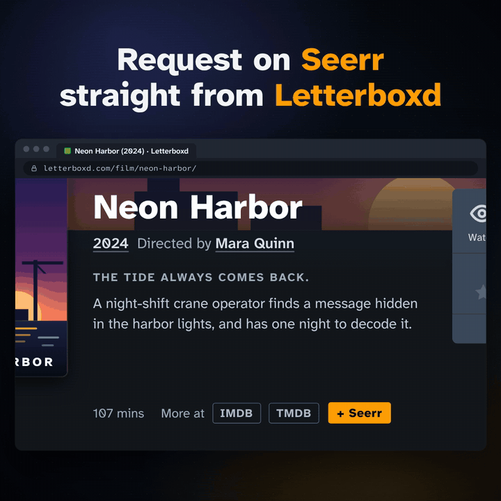

# Letterboxd vers Seerr

[🇫🇷 Français](README.fr.md) | [🇬🇧 English](README.md)

Projet frère de [imdb-seerr](https://github.com/mat-d3v/imdb-seerr), pour IMDb (films et séries).

  

  <a href="https://cdn.jsdelivr.net/gh/mat-d3v/letterboxd-seerr@main/assets/letterboxd-seerr-presentation.mp4"><b>▶️ Voir la vidéo de présentation</b></a> (2:10, en anglais, sous-titrée) 
  <a href="assets/video-transcript.md">Transcription descriptive</a> (en anglais)

## Langues supportées

🇬🇧 Anglais, 🇫🇷 Français, 🇩🇪 Allemand, 🇪🇸 Espagnol, 🇮🇹 Italien, 🇵🇹 Portugais, 🇯🇵 Japonais

Le script détecte automatiquement la langue de votre navigateur.

## Fonctionnalités

- Demande de film en un clic depuis n'importe quelle page film Letterboxd
- Appel API direct, sans redirection ni recherche
- Le bouton affiche l'état dès le chargement de la page : vert si déjà demandé, bleu si déjà disponible dans votre bibliothèque
- Vérification des doublons et de la disponibilité avant l'envoi de la demande
- Fonctionne même sur les fiches sans lien TMDB : le script se rabat sur une recherche par titre dans votre Seerr, en préférant le résultat dont l'année correspond à la fiche, et affiche un message clair si le film reste introuvable
- Profil qualité par défaut optionnel, choisi une fois depuis votre instance Seerr et réappliqué automatiquement à chaque demande
- Choix de tag à chaque demande, récupéré en direct depuis Seerr, jamais mémorisé — un tag différent (ou aucun) à chaque fois si besoin
- Configuration persistante (survit aux mises à jour du script) avec mises à jour automatiques depuis GitHub
- Notifications animées avec le titre du film
- Fonctionne sur tous les navigateurs avec un gestionnaire de scripts, y compris Safari sur iPhone/iPad

## Prérequis

Votre instance Seerr doit être accessible depuis votre navigateur, que ce soit sur votre réseau local ou via un VPN comme Tailscale.

> **Note :** `GM_xmlhttpRequest` (utilisé par Tampermonkey) contourne les restrictions mixed content du navigateur, donc HTTP fonctionne parfaitement. Si vous utilisez une extension basée sur `fetch`, HTTPS sera nécessaire.

## Installation

1. Installez un gestionnaire de userscripts :
   - Safari (Mac) : [Tampermonkey](https://apps.apple.com/fr/app/tampermonkey/id6738342400) *(recommandé)*
   - Safari (Mac/iPhone/iPad) : [Userscripts](https://apps.apple.com/app/userscripts/id1463298887)
   - Chrome/Firefox : [Tampermonkey](https://www.tampermonkey.net)

2. Cliquez [ici](https://raw.githubusercontent.com/mat-d3v/letterboxd-seerr/main/letterboxd-seerr.user.js) pour installer le script

3. Ouvrez n'importe quelle page film Letterboxd et cliquez sur le bouton `+ Seerr` : le script vous demande l'URL de votre Seerr (ex : http://192.168.1.x:5055) et votre clé API (Seerr, Paramètres, Général, Clé API) à la première utilisation. C'est tout.

Pour modifier la configuration plus tard : entrée « Configurer Seerr » dans le menu Tampermonkey, ou Maj+clic sur le bouton.

Si votre instance Seerr a des profils qualité configurés, utilisez l'entrée « Choisir le profil qualité par défaut » du menu Tampermonkey pour en choisir un — il est mémorisé et appliqué automatiquement à chaque demande. Choisissez « Défaut Seerr » pour ne plus le forcer.

## Utilisation

Ouvrez n'importe quelle page film sur Letterboxd. Un bouton `+ Seerr` apparaîtra à côté du lien TMDB :

- **`+ Seerr` orange** : cliquez pour demander le film sans quitter la page
- **`✓ Seerr` vert** : déjà demandé
- **`✓ Seerr` bleu** : déjà disponible dans votre bibliothèque

Si votre instance Seerr a des tags configurés sur sa connexion Radarr, une petite fenêtre s'ouvre à chaque nouvelle demande pour en choisir un (ou aucun) — ce choix n'est jamais mémorisé, vous pouvez donc taguer différemment à chaque fois.

## iOS / iPadOS

Le script fonctionne dans Safari sur iPhone et iPad avec l'app [Userscripts](https://apps.apple.com/app/userscripts/id1463298887) (gratuite). Il suffit que votre instance Seerr soit joignable depuis l'appareil, par exemple via Tailscale. La configuration se fait au premier appui, comme sur ordinateur.

## Licence

MIT